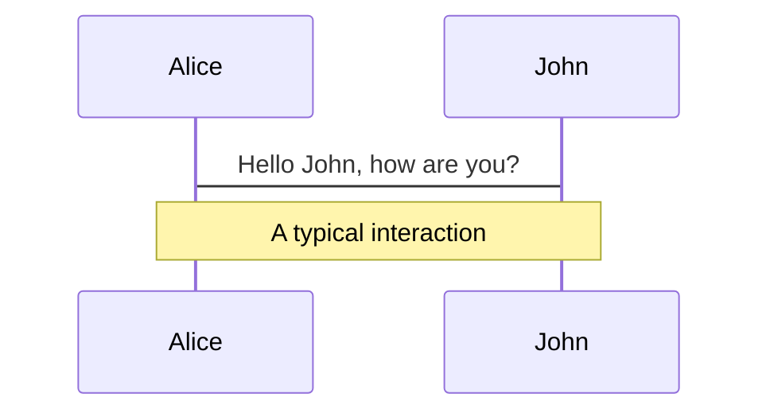
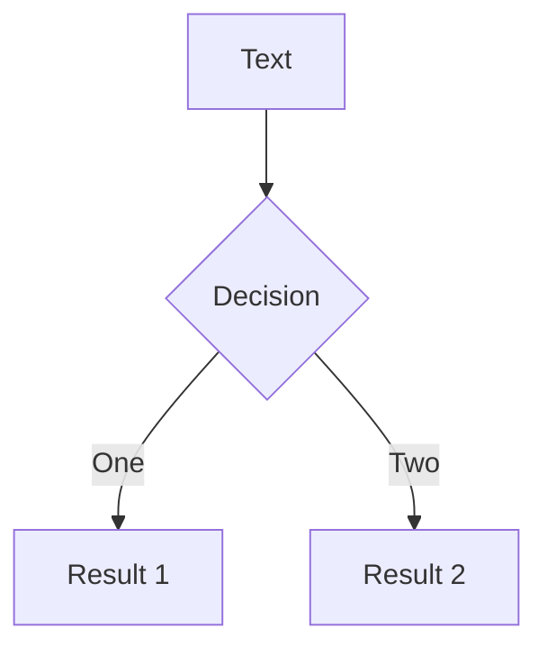
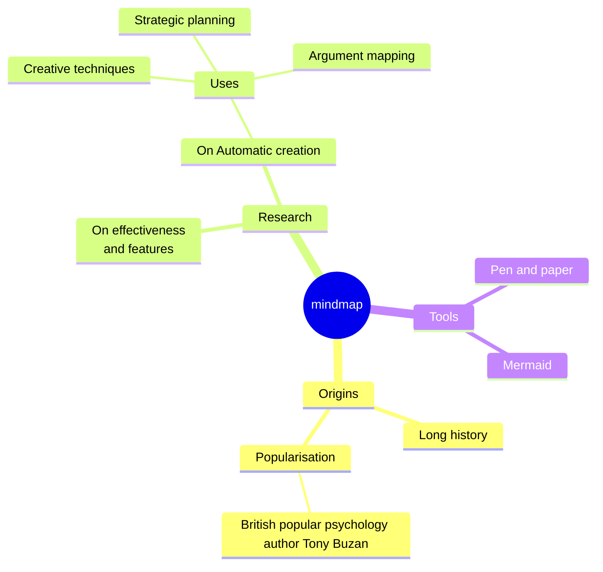
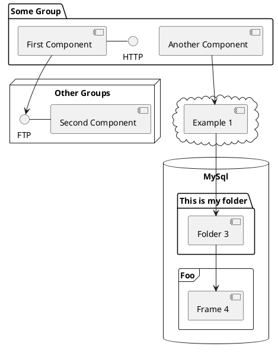

# My Presentation Template

20yy/mm/dd presentation for XXXX

@kazu_kichi_67

<div class="abs-br m-6 flex gap-2">
  <a href="https://x.com/kazu_kichi_67" target="_blank" alt="X" title="Open in X"
    class="text-xl slidev-icon-btn opacity-50 !border-none !hover:text-white">
    <carbon-logo-x />
  </a>
  <a href="https://github.com/kazu-kichi-67" target="_blank" alt="GitHub" title="Open in GitHub"
    class="text-xl slidev-icon-btn opacity-50 !border-none !hover:text-white">
    <carbon-logo-github />
  </a>
</div>

---
src: ./pages/who-am-i.md
hide: false
---

---
hideInToc: true
---

# Agenda

***

<br>
<Toc maxDepth="2"/>

---
layout: section
---

# Section1

---

## List Sample

***

<br>

<v-clicks>

- aaa
- bbb
- ccc

</v-clicks>

<style>
  ul {
    font-size: 18pt;
  }
</style>

---

## Table Sample

***

Table Sample.

|        |                              |
| ------ | ---------------------------- |
| AAAAAA | aaa                          |
| BBB    | bbbbbbbb                     |
| C      | <kbd>ccccccccccccccccc</kbd> |

---
layout: section
---

<div id="highlight-contents">
highlight!!!
</div>

<style>
  #highlight-contents {
    font-size: 144pt;
  }
</style>

---
layout: section
---

# Section2

---

## Code Sample

***

code sample.

```java {*|3|2-4|1,5|*}
class HelloWorld {
	public static void main(String[] args) {
		System.out.println("Hello, world.");
	}
}
```

<style>
pre.slidev-code {
    background-color: #1f2020;
}
</style>

---

## Diagrams Sample

***

diagrams sample.

<div class="grid grid-cols-4 gap-5 pt-4 -mb-6">









</div>

---

## Tips

***

The <span v-mark.red><code>code</code> directive</span>
also allows you to add
<span v-mark.circle.orange>inline marks</span>
, powered by [Link](https://roughnotation.com/)

<logos-java class="text-7xl m-3 absolute right-20" />

---
layout: center
class: text-center
hideInToc: true
---

# End

<PoweredBySlidev mt-10 />
